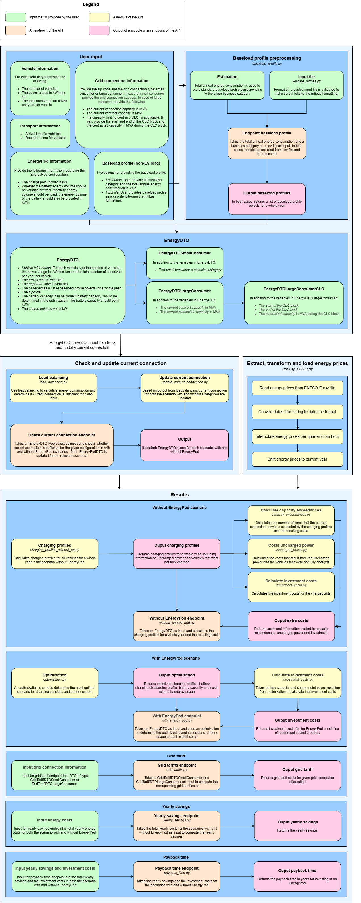

# Application logic of the EnergyPod Calculator API

The EnergyPod Calculator API is built up out of several different endpoints that are used together to calculate the business case of an EnergyPod based on a configuration for your company that you can provide as input. The different endpoints can also be accessed separately.

The ordering and interaction between the endpoints, if they were to be used together, is shown in the schema below. In order to test the endpoints as a whole, you will need to configure an `EnergyDTO` object for the configuration of your company that serves as input for the API.

### What to configure as input
To test the application as a whole, you will need to configure an `EnergyDTO` object, with the following input:
- **Vehicle information**: There are three types of vehicles that are considered: vans, box trucks and semi-trailer trucks. For each type of vehicle, provide the number of vehicles, the power usage in kWh per km and the total number of km driven per year per vehicle as `VehicleTypeInfoDTO` object. The `VehicleTypeInfoDTO` objects for each vehicle type are bundled into a `VehilceInfoDTO` object that can be provided as *vehicle information* input for the `EnergyDTO` object.
- **Transport information**: The transportation information consists of the arrival and departure time of the vehicles. Each can be provided to the `EnergyDTO` separately. The arrival and departure time should be provided as a string following the format `'HH:MM'`. Overnight charging is also considered, if the provided arrival time is after the provided departure time.
- **Baseload profile (non-EV load)**: There are two options for providing a baseload profile. In both cases, you need to convert the input to a list of `BaseloadProfile` objects that can be provided to the `EnergyDTO` object as baseload.
    - *Estimation*: You can provide a business category and the total annual energy consumption of the company in kWh. These two inputs can be used in the *Baseload Profile Endpoint*, which takes a standard normalised baseload profile corresponding to the specified business category and applies scaling using the provided total annual energy consumption of the company. The output is a list of `BaseloadProfile` objects representing the baseload profile for a whole year.
    - *Input file*: You can also provide the baseload profile of the company as a csv-file following the formatting as used in these files for [standard electricity profiles](https://energiedatawijzer.nl/onderwerpen/profielen/standaardprofielen/). In this case you can use the *Validate Baseload Endpoint* to validate the format of the provided baseload profile. This ensures that the provided csv-file can be correctly processed by the *Baseload Profile Endpoint* and converted to a list of `BaseloadProfile` objects representing the baseload profile for a whole year.
- **Grid connection information**: The grid connection information consists of the zip code and information related to the grid connection type. There are three options for the grid connection type: small consumer, large consumer and large conusmer with a CLC (capacity limiting contract). Each type of grid connection requires an additional set of parameters as input for the `EnergyDTO`.
    - *Small consumer*: In the case of a small consumer, you need to provide the small consumer connection category.
    - *Large consumer*: In the case of a large consumer, you need to provide the contract capacity in MVA and the connection capacity in MVA.
    - *Large consumer with CLC*: In the case of a large consumer with CLC, you need to provide the contract capacity in MVA, the connection capacity in MVA, the start time of the CLC block, the end time of the CLC block and the contracted capacity during the CLC block in MVA.
- **EnergyPod information**: The EnergyPod information consists of the following parameters:
    - *Charge point power*: The charge point power is the maximum power that can be used to charge a vehicle. The charge point power should be provided as an integer and in kW.
    - *Battery capacity*: The battery capacity can be variable or fixed. If you want to use a preset value for the battery capacity in the optimization, you need to fix the battery capacity by providing its value as input in the `EnergyDTO` object. This value should be in kWh. If you want to let the optimization determine the optimal battery capacity based on the energy demand and the investment costs for a battery, the battery capacity needs to be a variable with the optimization. In this case, you can set the battery capacity to be `None`.

### Baseload Profile Endpoint
The *baseload profile endpoint* consists of two endpoints.
- **Endpoint for KO profiles**: This endpoint needs a business category and the total annual consumption of the company as input and can be used to obtain the baseload profile as a list of `BaseloadProfile` objects for a whole year.
- **Endpoint for input file**: This endpoint takes a csv-file containing the baseload profile for a company following the formatting as used in these files for [standard electricity profiles](https://energiedatawijzer.nl/onderwerpen/profielen/standaardprofielen/) as input an can be used to obtain the baseload profile as a list of `BaseloadProfile` objects for a whole year. Note that the csv-file that is provided is validated to be in the correct format. If this is not the case, an empty list is returned.

### Check Current Connection Endpoint
The *check current connection endpoint* consists of one endpoint. This endpoint takes an `EnergyDTO` object as input and checks for both the with and without EnergyPod scenario if the connection provided is sufficient for the configuration. In the scenario with EnergyPod, we also check to see if the current connection as provided in the input can be decreased. This endpoint returns an `EnergyDTOUpdate` object, which consists of two `EnergyDTO` objects, representing the updated input for the with and without EnergyPod scenario's.

### Without EnergyPod Endpoint
The *without EnergyPod endpoint* consists of three endpoints for a small consumer, large consumer and a large conusmer with CLC respectively. All three endpoints take an `EnergyDTO` object as input and calculate the energy consumption for the scenario without Energypod and the resulting costs and returns these as output.

You can use the initially configured `EnergyDTO` as input, or you can first use this initially configured `EnergyDTO` object as input for the *check current connection endpoint* to ensure that the current connection as provided is sufficient and then use the updated `EnergyDTO` as input.

### With EnergyPod Endpoint
The *with EnergyPod endpoint* consists of three endpoints for a small consumer, a large consumer and a large consumer with CLC respectively. All three endpoints take an `EnergyDTO` object as input and use an optimization to calculate the energy consumption by the charge points and the battery capacity and power usage. The resulting costs are derived from the results of the optimization and all results are returned as output.

You can use the initially configured `EnergyDTO` as input, or you can first use this initially configured `EnergyDTO` object as input for the *check current connection endpoint* to ensure that the current connection as provided is sufficient and then use the updated `EnergyDTO` as input. Using the initially configured `EnergyDTO` without the check could result in an unsolvable optimization problem. Using the *check current connection endpoint* to obtain a fitting `EnergyDTO` for the with EnergyPod scenario ensures that the optimization always returns a result.

### Grid Tariffs Endpoint
Aside from the energy usage costs that are determined in the *with and without EnergyPod endpoints*, there are also costs related to grid tariffs. These costs can be calculated using the *grid tariffs endpoint*. This endpoint contains two endpoints for a small consumer and a large consumer respectively.
- **Endpoint for a small consumer**: This endpoint takes a `GridTariffDTOSmallConsumer` object as input, consisting of the companies zip code and the small consumer connection category. This endpoint returns the annual grid tariff costs for a small consumer as provided in the input.
- **Endpoint for a large consumer**: This endpoint takes a `GridTariffDTOLargeConsumer` object as input, consisting of the companies zip code, the grid connection capacity, the grid contract capacity and the baseload represented as a list of `BaseloadProfile` objects. This endpoint returns the annual grid tariff costs for a large consumer as provided in the input.

### Yearly Savings Endpoint
This endpoint serves to be able to compare the with and without EnergyPod scenario results to one another. This endpoint takes the total yearly costs for both the with and without EnergyPod scenario as input and returns the yearly savings as output. The total yearly costs for both scenario's consist of the annual costs for energy usage, grid tariff, capacity exceedances and uncharged power.

### Payback Time Endpoint
This endpoint takes the yearly savings and the total investment costs in the scenario's with and without EnergyPod as input and returns the expected payback time on the investment. This endpoint is usually used in combination with the *yearly savings endpoint* as the yearly savings serve as input for this endpoint.
